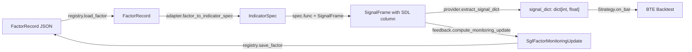

> **REFERENCE-ONLY (2026-07-12).** This repository has been superseded by
> **`packages/signal_bridge`** in the `xuer-quant` monorepo (ported at commit
> `df80f85`). It is preserved for history only — do not import from or depend on it.
> Import `signal_bridge` from the workspace package instead. The repo is
> intentionally **not** GitHub-archived so the hotfix path stays open.

# cos-signal-bridge

A bridge package that connects COS-SDL factor definitions, COS-SGL signal computation, and
COS-BTE backtesting into a unified pipeline. It converts SDL `FactorRecord` expression trees
into tradeable signals, surfaces those signals to NautilusTrader-based strategies, and closes
the monitoring loop by writing post-backtest IC feedback back to the SDL file registry.

Requires Python >= 3.11.

---

## Installation

Install with SDL schemas only (no SGL or BTE required):

```bash
pip install cos-signal-bridge
```

With SGL (SignalFrame computation):

```bash
pip install cos-signal-bridge[sgl]
```

With BTE (NautilusTrader backtesting):

```bash
pip install cos-signal-bridge[bte]
```

Full development install (includes linting, type checking, and test tools):

```bash
pip install -e ".[dev,sgl,bte]"
```

---

## Pipeline

### Mermaid diagram



### ASCII diagram

```
FactorRecord JSON
  |  registry.load_factor()
  v
FactorRecord
  |  adapter.factor_to_indicator_spec()
  v
IndicatorSpec
  |  spec.func(df) + apply to SignalFrame
  v
SignalFrame [sdl_{name}_{version} column]
  |                        |
  |  provider.extract_     |  feedback.compute_
  |  signal_dict()         |  monitoring_update()
  v                        v
signal_dict ------>  SglFactorMonitoringUpdate
  |  Strategy.on_bar()     |  registry.save_factor()
  v                        v
BTE Backtest         Updated FactorRecord JSON
```

The full cycle is: load a registered factor, convert it to an SGL indicator, compute signals
into a `SignalFrame`, inject those signals into a BTE strategy for backtesting, then feed
realized IC metrics back to the registry. The registry file is updated atomically so each
iteration leaves a consistent on-disk state.

---

## Public API (v3.1)

`cos-signal-bridge` exposes a stable, typed public surface for Marimo research
notebooks. The import path is `signal_bridge` (the Python package name);
`cos-signal-bridge` is the distribution name on PyPI / in `pyproject.toml`.

### Researcher-facing symbols

| Symbol | Purpose | Phase |
|---|---|---|
| `evaluate(expression, df) -> pd.Series` | Evaluate an `ExpressionNode` DAG with a pre-flight cost gate | BRIDGE-01 |
| `compute_lookback(expression) -> int` | Preview warmup-bar count before calling `evaluate` | (shipped pre-v3.1) |
| `ExpressionCostExceeded(ValueError)` | Raised by `evaluate` on cost-limit violation | BRIDGE-01 |
| `OperatorSignature` | Pydantic v2 frozen model: arity, shape, param types, window bounds | BRIDGE-03 |
| `OperatorSignatureRegistry` | `dict[OperatorTag, OperatorSignature]` — every operator covered | BRIDGE-03 |
| `run_walk_forward(factor_record, folds, data) -> WalkForwardResult` | Walk-forward harness (Flask-free — safe inside Marimo) | BRIDGE-02 |
| `WalkForwardResult`, `FoldResult` | Typed result containers | (shipped pre-v3.1) |
| `generate_factor_folds(start, end, test_days) -> list[WindowSpec]` | OOS-only fold generator (no train window — implicit zero) | (shipped pre-v3.1) |
| `_build_ephemeral_factor_record(expression, metadata) -> FactorRecord` | Build a `FactorRecord(status=pending)` for backtesting without SDL registry writes | BRIDGE-02 |
| `EphemeralFactorMetadata` | Typed Pydantic input for the ephemeral helper | BRIDGE-02 |

### Marimo authoring snippet

```python
# Marimo cell — signal authoring
import marimo as mo
from sdl.models.ir import ExpressionNode
from sdl.types import OperatorTag, TypeTag
from signal_bridge import (
    evaluate,
    ExpressionCostExceeded,
    OperatorSignatureRegistry,
)

# Inspect operator contract
sig = OperatorSignatureRegistry[OperatorTag.roll_mean]
# OperatorSignature(operand_arity=1, operand_shape='Series',
#                   param_types={'n': 'int'}, min_window=1, max_window=1024)

# Compose expression: roll_mean(close, n=14)
close = ExpressionNode(op=OperatorTag.close, inferred_type=TypeTag.Series)
expr = ExpressionNode(
    op=OperatorTag.roll_mean,
    children=[close],
    params={"n": 14},
    inferred_type=TypeTag.Series,
)

# df: pd.DataFrame with a 'close' column
try:
    series = evaluate(expr, df)
except ExpressionCostExceeded as e:
    # Structured fields for Marimo error-cell rendering:
    # e.node_id (str UUID), e.limit_name, e.limit_value, e.observed_value
    mo.md(f"**Cost exceeded:** `{e.limit_name}` at node `{e.node_id}`")
```

### Static cost model (BRIDGE-01)

`evaluate()` runs a single pre-flight visitor over the expression DAG and raises
`ExpressionCostExceeded` before any operator handler executes. Limits (hard-coded in
v3.1; no env overrides):

| Limit | Value | Semantics |
|---|---|---|
| `total_lookback` | `<= 2000` | Additive warmup bars across the whole tree (matches `compute_lookback`) |
| `node_count` | `<= 256` | Total nodes in the DAG |
| `max_window` | `<= 1024` | Largest single-node window param (`n` / `span` / `halflife`) |

`ExpressionCostExceeded` carries structured fields: `node_id: str`, `limit_name`,
`limit_value: int`, `observed_value: int`. The message template is:

```
Expression cost exceeded: {limit_name}={observed_value} > {limit_value} at node_id='{uuid}'
```

### Walk-forward (BRIDGE-02)

```python
from datetime import date
from signal_bridge import (
    run_walk_forward,
    generate_factor_folds,
    _build_ephemeral_factor_record,
    EphemeralFactorMetadata,
)

metadata = EphemeralFactorMetadata(
    name="mean reversion 14d",
    signal_name="mr_14",
    version="0.1.0",
    author="researcher@example.com",
)
factor = _build_ephemeral_factor_record(expr, metadata)  # status=pending, no registry write

# NOTE: generate_factor_folds is OOS-only (no train window — implicit zero per
# D-09/D-10). The signature is (start, end, test_days) — there is no train_days
# kwarg at the bridge layer; the lower-level
# cos_bte.walkforward.windows.generate_windows is always invoked with a zero
# train window internally.
folds = generate_factor_folds(
    start=date(2020, 1, 1),
    end=date(2024, 12, 31),
    test_days=90,
)
result = run_walk_forward(factor, folds, data)  # WalkForwardResult
```

`run_walk_forward` has no `flask`, `fastapi`, or `uvicorn` in its import closure
(pinned by `tests/test_import_no_flask.py`). The ephemeral helper NEVER writes to
the SDL registry — the resulting `FactorRecord` lives only in the notebook session
with `FactorStatus.pending`.

### Operator signature registry (BRIDGE-03)

`OperatorSignatureRegistry` maps every `OperatorTag` (80 values, including regime
stubs) to an `OperatorSignature`. Useful for notebook-side operand-shape validation
before calling `evaluate`:

```python
from sdl.types import OperatorTag
from signal_bridge import OperatorSignatureRegistry

sig = OperatorSignatureRegistry[OperatorTag.roll_corr]
assert sig.operand_arity == 2
assert sig.operand_shape == "Series"
assert sig.param_types == {"n": "int"}
```

A CI coverage test (`tests/test_operator_signatures.py`) asserts 100% enum coverage
and fails with a readable diff of missing/extra keys on any future drift.

---

## API Reference

### signal_bridge.registry

File-based persistence for SDL `FactorRecord` instances. Each factor is stored as a single
JSON file named `{factor_id}.json` inside a configurable registry directory.

#### `save_factor`

```python
def save_factor(record: FactorRecord, registry_dir: Path) -> None: ...
```

Persist a `FactorRecord` to disk atomically using `tempfile.mkstemp` + `os.replace`. A
partial write is never visible to concurrent readers. The registry directory is created if
it does not exist.

| Parameter      | Type           | Description                                             |
|----------------|----------------|---------------------------------------------------------|
| `record`       | `FactorRecord` | The factor record to persist.                           |
| `registry_dir` | `Path`         | Directory for JSON storage. Created automatically.      |

**Returns:** `None`

**Raises:**
- `ValueError` — if any `node_id` UUID appears more than once in the `ExpressionNode` tree
  (cycle/duplicate detection).

**Example:**

```python
from pathlib import Path
from uuid import uuid4
from sdl.models.factor import FactorRecord
from sdl.models.ir import ExpressionNode
from sdl.types import FactorStatus, OperatorTag
from signal_bridge.registry import save_factor, load_factor

registry = Path("/tmp/registry")

# Build a minimal FactorRecord for lag(close, 1)
close_node = ExpressionNode(node_id=uuid4(), op=OperatorTag.close, children=[], params={})
lag_node = ExpressionNode(
    node_id=uuid4(), op=OperatorTag.lag, children=[close_node], params={"n": 1}
)
record = FactorRecord(
    factor_id=uuid4(),
    signal_name="lag_close_1",
    expr_ir=lag_node,
    canonical_expr="lag(close, 1)",
    status=FactorStatus.active,
)

save_factor(record, registry)
# Writes: /tmp/registry/{factor_id}.json
```

---

#### `load_factor`

```python
def load_factor(factor_id: UUID, registry_dir: Path) -> FactorRecord: ...
```

Load a `FactorRecord` from the registry directory by UUID. Deserializes via Pydantic
`model_validate_json`.

| Parameter      | Type   | Description                                    |
|----------------|--------|------------------------------------------------|
| `factor_id`    | `UUID` | UUID of the factor to load.                    |
| `registry_dir` | `Path` | Directory containing `{factor_id}.json` files. |

**Returns:** The deserialized `FactorRecord`.

**Raises:**
- `FileNotFoundError` — if no file for the given `factor_id` exists.

**Example:**

```python
from uuid import UUID
from signal_bridge.registry import load_factor

factor_id = UUID("12345678-1234-5678-1234-567812345678")
record = load_factor(factor_id, Path("/tmp/registry"))
print(record.signal_name)
```

---

#### `list_factors`

```python
def list_factors(
    registry_dir: Path,
    *,
    status: FactorStatus | None = None,
) -> list[FactorRecord]: ...
```

Return all `FactorRecord` instances from the registry directory. Optionally filter by
`FactorStatus`.

| Parameter      | Type                    | Description                                              |
|----------------|-------------------------|----------------------------------------------------------|
| `registry_dir` | `Path`                  | Directory to scan for `*.json` files.                    |
| `status`       | `FactorStatus` or `None`| If provided, only records with this status are returned. |

**Returns:** List of `FactorRecord` instances. Returns an empty list if the directory does
not exist.

**Example:**

```python
from sdl.types import FactorStatus
from signal_bridge.registry import list_factors

# All factors
all_factors = list_factors(Path("/tmp/registry"))

# Only active factors
active = list_factors(Path("/tmp/registry"), status=FactorStatus.active)
print(f"{len(active)} active factors")
```

---

### signal_bridge.evaluator

Dispatch-table visitor that walks an `ExpressionNode` DAG bottom-up and maps each
`OperatorTag` to its pandas/numpy implementation.

All 80 operator tags from the SDL spec are covered:
- Primitives (close, open, high, low, volume, etc.)
- Unary and binary arithmetic (neg, abs, sign, add, sub, mul, div, pow, etc.)
- Temporal (lag, diff, pct_change, roll_mean, roll_std, roll_zscore, roll_autocorr, etc.)
- Normalization (zscore, rank_norm, winsorize, minmax, demean, standardize)
- Decay (ewm, ewm_std, decay_linear)
- Comparison (gt, lt, gte, lte, eq, crossover, crossunder, above_zero, below_zero)
- Logical (and_, or_, not_)
- Composition (to_signal, scale, combine)
- Regime: `regime_gate`, `regime_blend`, `regime_switch` raise `NotImplementedError` in v1.

#### `evaluate`

```python
def evaluate(node: ExpressionNode, df: pd.DataFrame) -> pd.Series: ...
```

Evaluate an `ExpressionNode` tree bottom-up against a DataFrame. Each child is evaluated
before its parent. Returns a `pd.Series` aligned to `df.index`.

| Parameter | Type             | Description                                                   |
|-----------|------------------|---------------------------------------------------------------|
| `node`    | `ExpressionNode` | Root of the subtree to evaluate.                              |
| `df`      | `pd.DataFrame`   | DataFrame containing primitive columns keyed by OperatorTag.  |

**Returns:** `pd.Series` with the same index as `df`.

**Raises:**
- `NotImplementedError` — for regime operators (v1 stub).
- `NotImplementedError` — for any operator not registered in the dispatch table.

**Example:**

```python
import pandas as pd
from uuid import uuid4
from sdl.models.ir import ExpressionNode
from sdl.types import OperatorTag
from signal_bridge.evaluator import evaluate

# Build lag(close, 1)
close_node = ExpressionNode(node_id=uuid4(), op=OperatorTag.close, children=[], params={})
lag_node = ExpressionNode(
    node_id=uuid4(), op=OperatorTag.lag, children=[close_node], params={"n": 1}
)

df = pd.DataFrame({"close": [100.0, 101.0, 102.0, 103.0, 104.0]})
result = evaluate(lag_node, df)
# result: [NaN, 100.0, 101.0, 102.0, 103.0]
print(result.tolist())
```

---

#### `compute_lookback`

```python
def compute_lookback(node: ExpressionNode) -> int: ...
```

Compute the total lookback (warmup bars) required for an `ExpressionNode` tree. Uses an
additive bottom-up combination: `roll_mean(lag(close, 5), n=14)` = 5 + 13 = 18, not
max(5, 14). This is the conservative choice — it guarantees the outer window always has `n`
fully-valid inner values.

| Parameter | Type             | Description                    |
|-----------|------------------|--------------------------------|
| `node`    | `ExpressionNode` | Root of the expression tree.   |

**Returns:** Total number of warmup bars required before the first valid output.

**Example:**

```python
from uuid import uuid4
from sdl.models.ir import ExpressionNode
from sdl.types import OperatorTag
from signal_bridge.evaluator import compute_lookback

close_node = ExpressionNode(node_id=uuid4(), op=OperatorTag.close, children=[], params={})
lag_node = ExpressionNode(
    node_id=uuid4(), op=OperatorTag.lag, children=[close_node], params={"n": 5}
)
roll_node = ExpressionNode(
    node_id=uuid4(), op=OperatorTag.roll_mean, children=[lag_node], params={"n": 14}
)

lb = compute_lookback(roll_node)
# lb == 18   (5 from lag + 13 from roll_mean[n-1])
print(lb)
```

---

### signal_bridge.normalization

Normalization closure factory. Wraps a raw evaluator callable with normalization (method,
window, clip), optional inversion, and a warmup NaN mask. Has zero SGL imports — it
operates purely on `pd.Series`.

#### `make_normalized_callable`

```python
def make_normalized_callable(
    fn: Callable[[pd.DataFrame], pd.Series],
    config: NormalizationConfig | None,
    combined_lookback: int,
    *,
    invert: bool = False,
) -> Callable[[pd.DataFrame], pd.Series]: ...
```

Wrap a raw evaluator function with the full normalization pipeline:
1. Call `fn(df)` to get the raw series.
2. Apply normalization (tanh_zscore, minmax, rank, passthrough).
3. Clip to `[clip_lo, clip_hi]` if configured.
4. Negate if `invert=True`.
5. Force the first `combined_lookback` elements to `NaN` (warmup mask).

No scipy dependency. All normalization methods are implemented with pandas and numpy.

| Parameter          | Type                           | Description                                                    |
|--------------------|--------------------------------|----------------------------------------------------------------|
| `fn`               | `Callable[[DataFrame], Series]`| Raw evaluator callable to wrap.                                |
| `config`           | `NormalizationConfig` or `None`| Normalization config (method, window, clip_lo, clip_hi). If `None`, passes through with warmup mask only. |
| `combined_lookback`| `int`                          | Number of warmup bars to force to NaN. Formula: `expr_lookback + norm_config.window`. |
| `invert`           | `bool`                         | If `True`, negate the output after clip. From `SglIntegration.invert`, not `NormalizationConfig`. |

**Returns:** A new callable `(pd.DataFrame) -> pd.Series` with full normalization applied.

**Example:**

```python
import pandas as pd
import numpy as np
from sdl.models.config import NormalizationConfig
from sdl.types import NormMethod
from signal_bridge.normalization import make_normalized_callable

# A raw function that returns a zscore series
def raw_fn(df: pd.DataFrame) -> pd.Series:
    s = df["close"]
    return (s - s.mean()) / s.std()

config = NormalizationConfig(method=NormMethod.tanh_zscore, window=20, clip_lo=-3.0, clip_hi=3.0)
normalized_fn = make_normalized_callable(raw_fn, config, combined_lookback=20, invert=False)

df = pd.DataFrame({"close": np.random.randn(100).cumsum() + 100})
result = normalized_fn(df)
# First 20 bars are NaN (warmup), remaining are tanh-normalized and clipped to [-3, 3]
```

---

### signal_bridge.adapter

Converts a `FactorRecord` (SDL schema) into an `IndicatorSpec` (SGL schema). This is the
primary SDL-to-SGL seam.

Requires `xuer_sgl` to be installed. Raises `RuntimeError` if called without the `[sgl]`
optional dependency.

#### `factor_to_indicator_spec`

```python
def factor_to_indicator_spec(record: FactorRecord) -> IndicatorSpec: ...
```

Convert a `FactorRecord` into an SGL `IndicatorSpec`. The returned `IndicatorSpec.func` is
a `Callable[[pd.DataFrame], pd.Series]` that evaluates the expression tree, applies
normalization, enforces the warmup NaN mask, and produces a properly named output column.

Column naming convention: `sdl_{signal_name}_{signal_version}` (e.g., `sdl_lag_close_1_v1`).

Combined lookback = `expr_lookback + norm_window`, where `norm_window` is
`sgl_integration.normalization.window` (0 if no normalization).

| Parameter | Type           | Description                                          |
|-----------|----------------|------------------------------------------------------|
| `record`  | `FactorRecord` | SDL factor record with `sgl_integration` populated.  |

**Returns:** `IndicatorSpec` ready for `SignalFrame` construction.

**Raises:**
- `ValueError` — if `record.sgl_integration` is `None` or `signal_name` is `None`.
- `RuntimeError` — if `xuer_sgl` is not installed.

**Example:**

```python
import pandas as pd
from pathlib import Path
from uuid import uuid4
from sdl.models.factor import FactorRecord
from sdl.models.config import SglIntegration, NormalizationConfig
from sdl.models.ir import ExpressionNode
from sdl.types import OperatorTag, NormMethod, FactorStatus
from signal_bridge.adapter import factor_to_indicator_spec

# Build FactorRecord for lag(close, 1) with tanh_zscore normalization
close_node = ExpressionNode(node_id=uuid4(), op=OperatorTag.close, children=[], params={})
lag_node = ExpressionNode(
    node_id=uuid4(), op=OperatorTag.lag, children=[close_node], params={"n": 1}
)
record = FactorRecord(
    factor_id=uuid4(),
    signal_name="lag_close_1",
    expr_ir=lag_node,
    canonical_expr="lag(close, 1)",
    status=FactorStatus.active,
    sgl_integration=SglIntegration(
        signal_name="lag_close_1",
        signal_version="v1",
        normalization=NormalizationConfig(
            method=NormMethod.tanh_zscore,
            window=20,
            clip_lo=-3.0,
            clip_hi=3.0,
        ),
        invert=False,
    ),
)

spec = factor_to_indicator_spec(record)
print(spec.name)        # "sdl_lag_close_1_v1"
print(spec.lookback)    # 21  (1 from lag + 20 from norm window)

# Apply to a DataFrame
df = pd.DataFrame({"close": range(100)}, dtype=float)
result = spec.func(df)
# First 21 bars are NaN; remaining are tanh-normalized lag(close, 1)
```

---

### signal_bridge.provider

Extracts SDL factor signal values from a `SignalFrame` into a format suitable for injection
into a NautilusTrader BTE strategy.

Requires `xuer_sgl` to be installed. Raises `RuntimeError` if called without the `[sgl]`
optional dependency.

#### `extract_signal_dict`

```python
def extract_signal_dict(sf: SignalFrame, col: str) -> dict[int, float]: ...
```

Extract VALID-bar values from a `SignalFrame` column as a `{ts_ns: float}` dict. Only bars
where `availability == VALID` are included. Keys are nanosecond integer timestamps matching
NautilusTrader `bar.ts_event`.

This is the SGL-to-BTE bridge seam: the strategy calls `signal_dict.get(bar.ts_event)` in
`on_bar()` to read the SDL factor value at each bar.

| Parameter | Type          | Description                                               |
|-----------|---------------|-----------------------------------------------------------|
| `sf`      | `SignalFrame` | SignalFrame produced by the SGL pipeline.                 |
| `col`     | `str`         | Column name to extract (e.g., `"sdl_lag_close_1_v1"`).   |

**Returns:** `dict[int, float]` mapping nanosecond integer timestamps to signal values,
containing only bars where `availability == VALID`.

**Raises:**
- `RuntimeError` — if `xuer_sgl` is not installed.
- `KeyError` — if `col` is not a column in the `SignalFrame`.

**Example:**

```python
from signal_bridge.provider import extract_signal_dict

# sf is a SignalFrame computed by the SGL pipeline
# col is the SDL factor column name
signal_dict = extract_signal_dict(sf, col="sdl_lag_close_1_v1")

# Inject into strategy constructor
class SDLStrategy(Strategy):
    def __init__(self, signal_dict: dict[int, float], ...):
        self._signal_dict = signal_dict

    def on_bar(self, bar):
        value = self._signal_dict.get(bar.ts_event)
        if value is not None and value > 0.5:
            # Generate buy signal
            ...
```

---

### signal_bridge.feedback

Closes the monitoring loop after a backtest by computing realized IC metrics and writing
the updated `FactorRecord` back to the registry.

Requires `xuer_sgl` to be installed. Raises `RuntimeError` if called without the `[sgl]`
optional dependency.

#### `compute_monitoring_update`

```python
def compute_monitoring_update(
    sf: SignalFrame,
    col: str,
    factor_id: UUID,
    window_start: datetime,
    window_end: datetime,
    registry_dir: Path,
) -> SglFactorMonitoringUpdate: ...
```

Compute post-backtest realized IC and apply factor status transitions.

The function:
1. Loads the `FactorRecord` from the registry.
2. Builds a VALID-bar mask (excludes `INSUFFICIENT_DATA` and other non-VALID states).
3. Computes realized IC (Spearman correlation of lagged signal vs forward returns, VALID bars only).
4. Computes realized rank IC (Pearson on percentile-ranked signal and returns).
5. Computes realized turnover (mean absolute diff of signal on VALID bars).
6. Applies OOS monitoring status transitions:
   - `active -> monitoring` if `realized_ic < ic_floor`.
   - `active/monitoring -> invalidated` if `realized_ic < ic_invalidation`.
7. Writes the updated `FactorRecord` back to the registry atomically.
8. Returns an `SglFactorMonitoringUpdate` (with `signal_id == factor_id`).

Note: `realized_regime_breakdown=[]` — regime-aware breakdown is deferred to a future plan.

| Parameter      | Type       | Description                                                  |
|----------------|------------|--------------------------------------------------------------|
| `sf`           | `SignalFrame` | SignalFrame containing the factor signal column and `close` prices. |
| `col`          | `str`      | Column name in `sf.data` / `sf.availability` for the factor. |
| `factor_id`    | `UUID`     | UUID of the `FactorRecord` in the registry.                  |
| `window_start` | `datetime` | Start of the evaluation window.                              |
| `window_end`   | `datetime` | End of the evaluation window.                                |
| `registry_dir` | `Path`     | Directory where `FactorRecord` JSON files are stored.        |

**Returns:** `SglFactorMonitoringUpdate` with realized IC, rank IC, turnover, and status flags.

**Raises:**
- `RuntimeError` — if `xuer_sgl` is not installed.
- `FileNotFoundError` — if `factor_id` does not exist in `registry_dir`.

**Example:**

```python
from datetime import datetime, timezone
from pathlib import Path
from signal_bridge.feedback import compute_monitoring_update

window_start = datetime(2024, 1, 1, tzinfo=timezone.utc)
window_end = datetime(2024, 12, 31, tzinfo=timezone.utc)

# sf is the SignalFrame from the completed backtest
update = compute_monitoring_update(
    sf=sf,
    col="sdl_lag_close_1_v1",
    factor_id=record.factor_id,
    window_start=window_start,
    window_end=window_end,
    registry_dir=Path("/tmp/registry"),
)

print(f"Realized IC:      {update.realized_ic:.4f}")
print(f"Realized Rank IC: {update.realized_rank_ic:.4f}")
print(f"Realized Turnover:{update.realized_turnover:.4f}")
print(f"Flagged:          {update.flagged}")
print(f"Invalidated:      {update.invalidate}")

# The FactorRecord on disk now has updated status and oos_monitoring fields
```

---

## Design Decisions

### File-based registry

`FactorRecord` instances are stored as individual JSON files named `{factor_id}.json` inside a
configurable directory. There is no database dependency. Atomic writes use
`tempfile.mkstemp` + `os.replace` to ensure a reader can never observe a partially-written
file. On any write error, the temporary file is cleaned up and the exception is re-raised.

Cycle detection at write time validates that all `node_id` UUIDs in the `ExpressionNode`
tree are unique. JSON is acyclic by construction after round-trip deserialization; the
uniqueness check catches the only meaningful structural error possible at write time.

This design choice removes the database dependency from the bridge package and keeps the
registry simple enough to inspect, diff, and version-control alongside strategy code.

### Normalization-in-closure pattern

`make_normalized_callable` returns a closure that captures the normalization config.
The closure applies the full pipeline in a single call: evaluate raw signal, normalize
(tanh_zscore / minmax / rank / passthrough), clip to configured bounds, optionally invert,
and apply the warmup NaN mask.

This keeps `adapter.py` clean (one call to create the normalized func) and keeps
`normalization.py` free of any SGL imports. The normalization module operates purely on
`pd.Series`. SGL coupling is isolated to `adapter.py` only — the only module that imports
from `xuer_sgl` at the SDL-to-SGL boundary.

### Additive lookback rule

`combined_lookback = expr_lookback + norm_window`.

For `roll_mean(lag(close, 5), n=14)`: `expr_lookback = 5 + 13 = 18`, plus any normalization
window. The conservative additive rule guarantees the outer window always receives `n`
fully-valid inner values. Using `max()` would undercount warmup bars: if `lag=5` and
`roll_mean n=14`, max would give 14 but the first valid roll_mean output requires bar 14 of
the already-shifted series, meaning bar 18 overall.

### Optional import guards

All modules that depend on SGL use a guarded import pattern:

```python
try:
    from xuer_sgl.signal_frame import SignalFrame
    from xuer_sgl.types import BarAvailabilityState
except ImportError:
    SignalFrame = None
    BarAvailabilityState = None
```

A bare `import signal_bridge` succeeds with only stdlib, pandas, numpy, and `cos-sdl`.
The SGL/BTE features raise `RuntimeError` with installation instructions when called
without the optional dependency. This keeps `cos-sdl` users able to use the registry and
evaluator without pulling in the full SGL stack.

### signal_dict injection pattern

`extract_signal_dict` produces `{ts_ns: float}` where keys are nanosecond integer
timestamps matching NautilusTrader `bar.ts_event`. The dict is injected into the strategy
constructor at backtest initialization time, not accessed via global state.

In `on_bar()`, the strategy calls `signal_dict.get(bar.ts_event)` to read the SDL factor
value. This decouples signal computation (SGL) from strategy execution (BTE): the SGL
pipeline runs once before the backtest loop; the strategy reads pre-computed values via
a simple dict lookup. The dict contains only VALID-bar entries, so `None` from `.get()`
unambiguously means the bar was in the warmup period or had insufficient data.

### signal_id == factor_id

In `SglFactorMonitoringUpdate`, `signal_id` is set to `factor_id`. There is no separate
signal UUID. The SDL `FactorRecord` is the authoritative identity for a signal — separating
signal identity from factor identity would require a mapping table with no benefit for v1.
This simplifies the feedback loop: the caller needs only the `factor_id` to round-trip from
backtest completion back to the registry write.

---

## Running Tests

Unit tests (no external data required):

```bash
pytest tests/ -v
```

End-to-end integration test (requires BTC-Forge OHLCV data mounted at `/data/ohlcv`):

```bash
BTC_FORGE_ROOT=/data/ohlcv pytest tests/test_e2e.py -v
```

Linting and type checking:

```bash
ruff check src/ tests/
black --check src/ tests/
mypy src/
```

---

## License

Part of the Xuer Capital COS ecosystem. All rights reserved.
