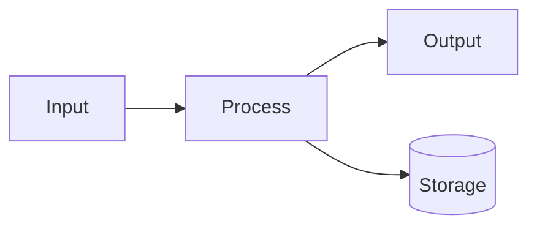

# Architecture

> Replace this with a written overview of this repo's internal structure.

## Sample data flow diagram

The diagram below is rendered by `pymdownx.superfences` + Material's bundled `mermaid.min.js`.
Replace it with a real diagram of this repo's components.

