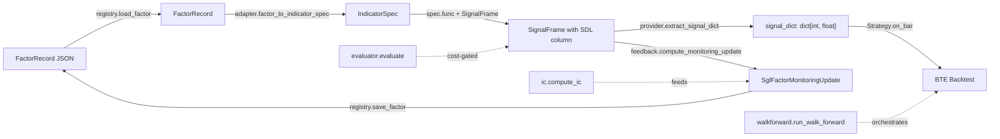

# Architecture

## Overview

cos-signal-bridge is a pure Python library that glues three COS packages into
a single factor lifecycle:

```
FactorRecord (SDL) → evaluate / IndicatorSpec → SignalFrame (SGL) →
    signal_dict → BTE backtest → IC / turnover feedback → FactorRecord (SDL)
```

### Module map (`src/signal_bridge/`)

| Module | Role |
|--------|------|
| `registry.py` | File-based `FactorRecord` persistence. Atomic JSON writes keyed by UUID; safe for concurrent readers. |
| `evaluator.py` | Dispatch-table visitor that walks `ExpressionNode` DAGs bottom-up against a DataFrame. Covers ~80 operators (regime operators currently stubbed). |
| `ic.py` | Canonical realised IC / rank IC implementation. **This is the single source of truth for IC** (GOV-02) — COS-CIE consumes values produced here. |
| `normalization.py` | Normalisation closure factory (`tanh_zscore`, `minmax`, `rank`, `passthrough`). No SGL imports — usable standalone. |
| `adapter.py` | Converts a `FactorRecord` into an `IndicatorSpec` (SDL → SGL seam). Requires the `[sgl]` extra. |
| `provider.py` | Extracts the VALID-bar `{ts_ns: float}` dict from a `SignalFrame` for BTE injection. Requires `[sgl]`. |
| `feedback.py` | Computes realised IC / rank IC / turnover after a backtest, applies OOS status transitions, writes updated `FactorRecord` atomically. Requires `[sgl]`. |
| `walkforward.py` | `run_walk_forward` harness — Flask-free, safe inside Marimo. Generates folds, executes per-fold evaluate + backtest, aggregates into `WalkForwardResult`. |
| `ephemeral.py` | `_build_ephemeral_factor_record` + `EphemeralFactorMetadata` — build a transient `FactorRecord(status=pending)` for backtesting without SDL registry writes. |
| `operator_signatures.py` | `OperatorSignature` + `OperatorSignatureRegistry` — frozen Pydantic v2 models describing arity, shape, param types, and window bounds for every operator. |
| `composition/` | Factor composition subpackage: `composite.py`, `library.py`, `models.py`, `orchestrator.py`, `polarity.py`, `types.py` plus `signals/` YAML catalogs. |

### Column naming + lookback

- Columns produced by the adapter are named `sdl_{signal_name}_{signal_version}`.
- Lookback is **additive**: `expr_lookback + norm_window` (taken from the
  factor's expression tree plus the configured normalisation window).

### Static cost model (BRIDGE-01)

`evaluate()` runs a single pre-flight visitor over the expression DAG and
raises `ExpressionCostExceeded` **before** any operator handler executes.
Limits are hard-coded in v3.1 (no env overrides):

| Limit | Value | Semantics |
|-------|-------|-----------|
| `total_lookback` | `≤ 2000` | Additive warmup bars across the tree |
| `node_count` | `≤ 256` | Total nodes in the DAG |
| `max_window` | `≤ 1024` | Largest single-node window param |

`ExpressionCostExceeded` carries structured fields (`node_id`, `limit_name`,
`limit_value`, `observed_value`) for rendering inside Marimo error cells.

## Diagram



## Layering rules

- `registry.py`, `evaluator.py`, `ic.py`, `normalization.py`,
  `operator_signatures.py` — no SGL / BTE imports; usable with SDL schemas only.
- `adapter.py`, `provider.py`, `feedback.py`, `walkforward.py` — require `[sgl]`.
- `run_walk_forward` is deliberately Flask-free so it can be imported from a
  Marimo notebook without pulling in an HTTP stack.
